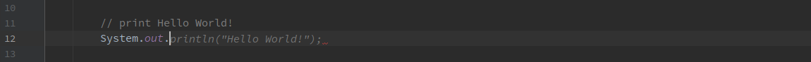
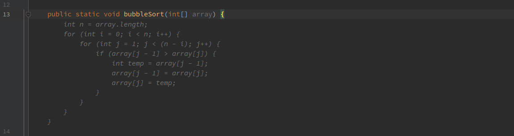
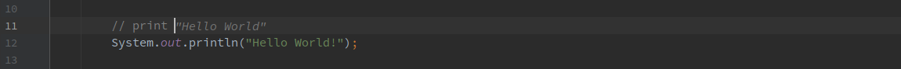
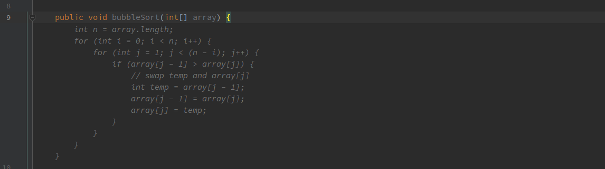

## Checklist

- Onboarding
  - [ ] Sign in with GitHub
  - [ ] Sign in with GitLab
  - [ ] Sign in with Google
- Autocomplete
  - [ ] Single-line autocomplete
  - [ ] Multi-line autocomplete
  - [ ] Infilling autocomplete
  - [ ] Cycle through autocomplete
- Commands
  - [ ] TODO
- Chat
  - [ ] TODO

## Onboarding

### Sign in with GitHub

TODO

### Sign in with GitLab

TODO

### Sign in with Google

TODO

## Autocomplete

### Single-line autocomplete

1. Paste following Java code:
    ```java
    // print Hello World!
    System.out.
    ```
2. Place cursor at the end of the `System.out.` line.
3. Trigger autocompletion with <kbd>Alt</kbd> + <kbd>/</kbd>.

#### Expected behaviour



### Multi-line autocomplete

1. Paste following Java code:
    ```java
    public void bubbleSort(int[] array) {
    ```
2. Place the cursor at the end of the line.
3. Trigger autocompletion with <kbd>Alt</kbd> + <kbd>/</kbd>.

#### Expected behaviour



### Infilling autocomplete

1. Paste following Java code:
    ```java
    // print 
    System.out.println("Hello World!");
    ```
2. Place cursor at the end of the `// print ` line.
3. Trigger autocompletion with <kbd>Alt</kbd> + <kbd>/</kbd>.

#### Expected behaviour



### Cycle through autocomplete

1. Paste following Java code:
    ```java
    public void bubbleSort(int[] array) {
    ```
2. Place the cursor at the end of the line.
3. Cycle forward with <kbd>Alt</kbd> + <kbd>]</kbd> or backward with <kbd>Alt</kbd> + <kbd>[</kbd>.

#### Expected behaviour



## Commands

### Explain Selected Code (Detailed)

1. Paste following Java code:
    ```java
    System.out.println("Hello, Cody!");
    ```
2. Select line and use `Cody | Commands | Explain Selected Code (Detailed)`.

#### Expected behaviour

* User is automatically switched to `Chat` tab.
* Chat responds with a **detailed** description of the selected code and will elaborate on the fields, classes, and methods, going into technical details, often structuring the text in bullet points.

### Explain Selected Code (High Level)

1. Paste following Java code:
    ```java
    System.out.println("Hello, Cody!");
    ```
2. Select line and use `Cody | Commands | Explain Selected Code (Detailed)`.

#### Expected behaviour

* User is automatically switched to `Chat` tab.
* Chat responds with a **high-level** and short description of the code without going into technical details.

### Generate Docstring

1. Paste following Java function:
    ```java
    public static String greet(String name) {
        return "Hello, " + name + "!";
    }
    ```
2. Select function and use `Cody | Commands | Generate Docstring`.

#### Expected behaviour

* User is automatically switched to `Chat` tab.
* Chat responds with generated documentation similar to this:
    ```java
    /*
     * Returns a greeting string with the provided name.
     *
     * @param name The name to greet.
     * @return A greeting string.
     */
    ```

### Generate Unit Test

TODO

### Improve Variable Names

1. Paste following Java code:
    ```java
    String[] var0 = new String[]{"apple", "banana", "peach"};
    ```
2. Select line and use `Cody | Commands | Improve Variable Names`

#### Expected behaviour

* User is automatically switched to `Chat` tab.
* Chat responds with generated documentation similar to this:
    ```java
    String[] fruits = new String[]{"apple", "banana", "peach"};
    ```

### Smell Code

TODO

## Chat

TODO
